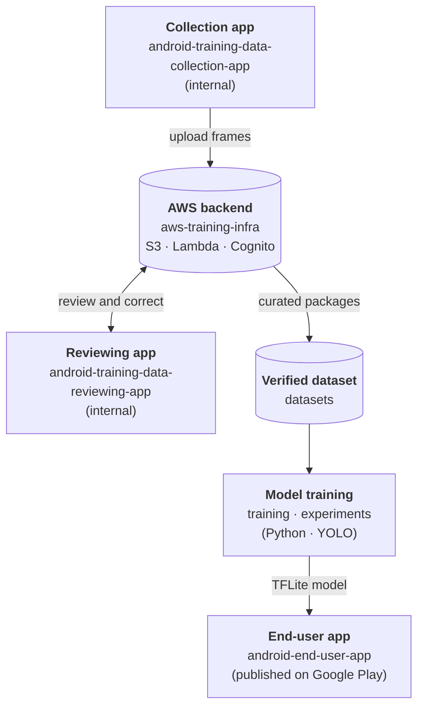

# Plate Detector — an end-to-end ML product loop

A license-plate detection product built as a complete, closed loop rather than a single app:
a **published Android app** that detects plates on-device in real time, plus the **data collection,
cloud backend, human labeling tool, and model-training pipeline** that keep improving the model
behind it.

The interesting part isn't any single component — it's that the whole lifecycle exists and is
wired together: *collect real-world data → store it securely → review and correct it → train a new
model → ship it back to the app.*

The data side is a **multi-user platform**: many collectors upload from their own devices, several
curators review, and a small number of administrators own the resulting dataset (see
[Who does what](#who-does-what)).

<!-- Add here: a short demo GIF/video of the end-user app and the reviewing app. -->

## How the pieces fit

## Who does what

The data-collection side is multi-user. Uploads are namespaced per user and device
(`uploads/<user_sub>/<device_id>/…`), so contributions from many people stay separate and
attributable.

| Role | How they get access | What they can do |
|---|---|---|
| **Collector** | Self-registers in the collection app (email + password) | Capture frames and upload their own packages; receive model updates. Cannot read anyone's data. |
| **Curator** | Added to the Cognito `curators` group by an administrator (not self-service) | Review, correct, accept, or reject uploaded packages in the reviewing app. Cannot delete raw uploads. |
| **Administrator** | The IAM principal named at deploy time (`AdminPrincipalArn`) | Everything above, plus **organizing new datasets**: consolidating the curated `done/` packages into a training set, and publishing models. |

**Only administrators can organize a new dataset.** Collectors and curators feed and clean the data,
and neither role has write access outside its own area (curators write only `curation/`, `done/`
and `rejected/`), so no one but an administrator can publish a training set or a model.

The published end-user app is outside this model: it has no accounts and no network access.

## Modules

Every module has its own README with the full description, setup, and design notes.

| Module | What it is | Why it exists |
|---|---|---|
| [`android-end-user-app/`](android-end-user-app/README.md) | The **published** Android app. Real-time on-device plate detection (TFLite YOLO) with ML Kit OCR. Detection-only: no accounts, no storage, no network. | The product itself. Kept deliberately minimal so it can make a strong privacy promise ("collects nothing") and pass Play Store review with trivial data-safety obligations. |
| [`android-training-data-collection-app/`](android-training-data-collection-app/README.md) | Internal Android app that runs the same detector but also captures frames (auto, manual, burst) and uploads them to the cloud on a schedule. | A model is only as good as its data. Collecting other people's plates is a different privacy posture from detecting them, so it lives in a separate, unpublished app. |
| [`android-training-data-reviewing-app/`](android-training-data-reviewing-app/README.md) | Internal Android app for a human curator to review each uploaded package: accept, reject, and correct bounding boxes. | Auto-labeled data contains mistakes. This is the human-in-the-loop step that turns raw uploads into a trustworthy training set. |
| [`aws-training-infra/`](aws-training-infra/aws/README.md) | AWS SAM stack: S3, Lambda, API Gateway (IAM-authenticated), Cognito User + Identity Pools, and scoped IAM roles. | The secure backbone between the apps: no static AWS keys in any APK, least-privilege access per role. |
| [`datasets/`](datasets/dataset_YOLO/README.md) | Specification of the YOLO dataset layout and how a compatible dataset is built. Images are not committed. | Defines the contract between curation and training. Kept out of the repo because of dataset licensing and privacy. |
| [`experiments/`](experiments/ultralytics/README.md) | Exploratory YOLO training/export scripts and a notebook. | A sandbox for trying approaches quickly and comparing them before anything is promoted into the pipeline. |
| [`training/`](training/ultralytics/README.md) | Reproducible YOLO training and TFLite export pipeline. | Turns the curated dataset into the model that ships in the app. |
| [`requirements/`](requirements/README.md) | One spec document per feature (`REQ-NNN`), written before implementation. | The decision trail: why each feature exists, what was tried, and what was reverted. |

## What this project demonstrates

- **On-device ML on Android** — camera pipeline, TFLite inference, and OCR running in real time, in
  Kotlin and Jetpack Compose.
- **Privacy by architecture** — the published app has no network permission at all. Data collection
  was split into a separate internal app instead of being hidden behind a setting.
- **Cloud backend design on AWS** — serverless (Lambda, API Gateway, S3), infrastructure as code
  (SAM), Cognito authentication, and scoped IAM roles per user type.
- **Secure client–cloud access** — short-lived credentials via a Cognito Identity Pool and SigV4
  signing, with no long-lived keys in the app.
- **A real human-in-the-loop workflow** — a purpose-built mobile labeling tool with box editing,
  pinch-zoom, resumable sessions, and workflow state derived entirely from storage.
- **ML pipeline thinking** — dataset spec, training, and export to a mobile format, tied back to the
  app that consumes the model.
- **Engineering discipline** — spec-driven development (41 numbered requirement documents),
  unit tests on Android and Lambda code, and signed release builds through GitHub Actions.

## Tech stack

| Area | Technologies |
|---|---|
| Android | Kotlin, Jetpack Compose, CameraX, TensorFlow Lite, ML Kit Text Recognition, WorkManager |
| Cloud | AWS SAM, S3, Lambda (Python 3.12), API Gateway HTTP API, Cognito (User + Identity Pools), IAM |
| ML | Ultralytics YOLO (v11), PyTorch, TFLite export |
| Tooling | Gradle, GitHub Actions (signed releases), pytest |

## Status

| Module | State |
|---|---|
| End-user app | Published on Google Play |
| Collection app | Working, internal use only |
| Reviewing app | Working, internal use only |
| AWS infrastructure | Deployed and in use |
| Training pipeline | Working; consolidating curated packages into one training set is still a manual step |

**Planned next:** automated dataset consolidation and retraining, and a vehicle-type classifier for
parking access control. See the [end-user app roadmap](android-end-user-app/ROADMAP.md).

## Note: why the image size is 640×480

The original idea was to train on larger images. The only training dataset that could be found,
however, was 640×480, so the pipeline was built around those sizes. The collection app was then
given the ability to build new datasets at larger sizes (HD, 1280×720), and after that it became
possible to switch the model to a larger input.

That experiment did not go well: even at 640×480, recognition already takes a relatively long time
on a phone, and a larger input made it slower still. So the project did not continue in that
direction and stays at 640×480 (with 1280×720 kept as a capture option). See
[REQ-042](requirements/REQ-042-done-collection-frame-size-restriction.md) for how frame sizes are
restricted and recorded.

## Privacy

The published app processes camera frames in memory and never stores or transmits them. The
internal collection app is not distributed, for the reasons explained in its README. See the
[Privacy Policy](privacy-policy.md).

## License

Licensed under **AGPL-3.0-only** — see [LICENSE](LICENSE). Ultralytics YOLO is AGPL-3.0, and model
artifacts produced through that pipeline are treated as AGPL-3.0 by default. See
[Third-Party Notices](THIRD_PARTY_NOTICES.md).
